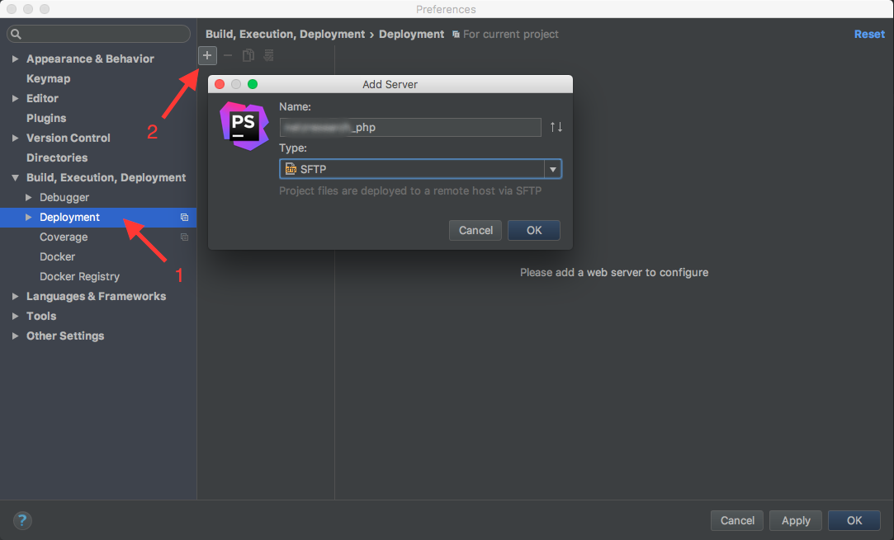
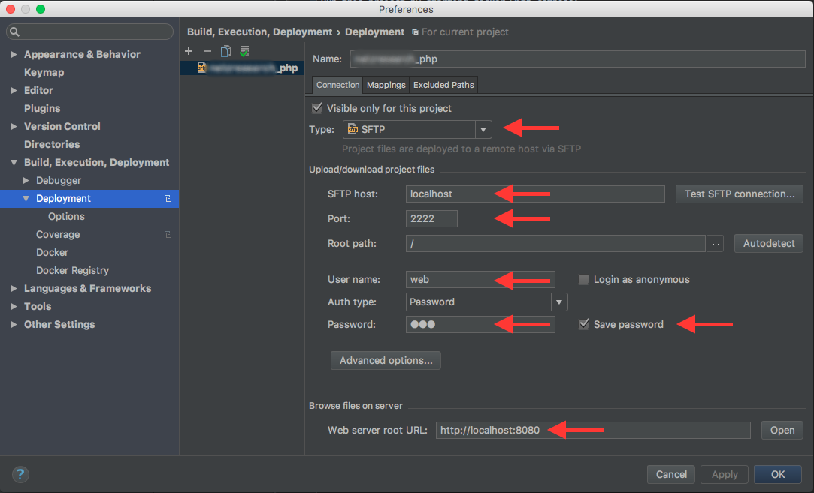
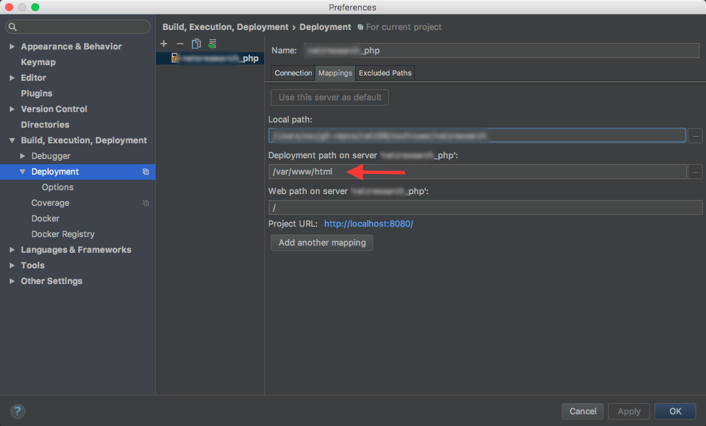
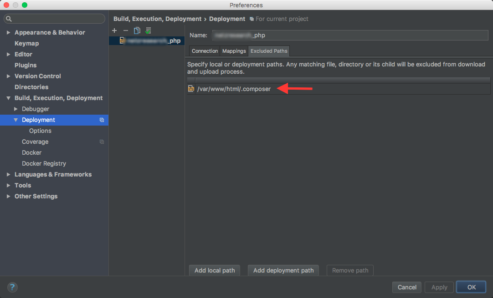
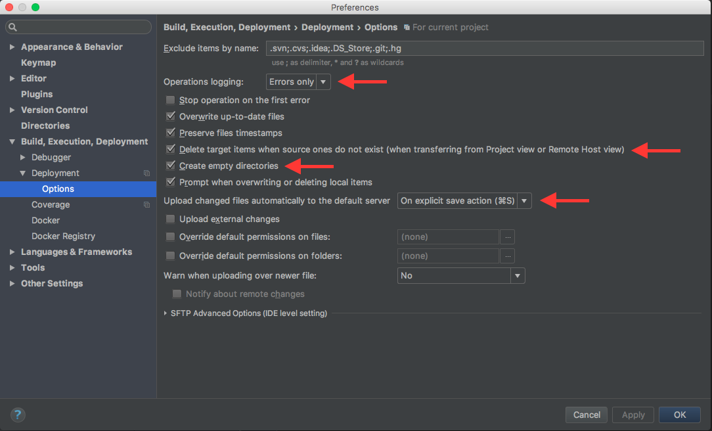

# symfony3-docker-php71

Simple Docker setup for Symfony 3+ with PHP 7.1, Apache2 and MySQL.

## Docker setup

Run this project by starting docker with compose:

```bash
    docker-compose up -d    
```

Login with this little helper script from within the project dir 
(just for convenience, `docker exec` will too):

```bash
    ./bin/dexec
```

You can also login by using plain old SSH:

```bash
    # Please refer to "Security" section for password informations!
    ssh -p 2222 web@localhost
```

## PHPStorm setup

1. Go to the `Deployment` settings for this project and add an `SFTP` deployment



2. Enter connection informations:



3. Configure project paths mappings:



4. Configure exclude paths mappgins:



5. Set proper deploy and sync options



## Environment

* **SSH** is mapped to `2121` and `2222`
* **MySQL** is mapped to `33060`
* **Apache** is mapped to `8080`

## Security

**MySQL**

Please refere to the environment variables set within the `docker-compose.yml`-file.

**Webserver**

By default the password for the webserver user (`web`) is also `web`.

If you like to change the password, just pass the `WEBSERVER_PASSWORD`-environment variable with your desired password to the container within
your `docker-compose.yml`-file:

```yaml

services:
  // ...
  php:
    // ...
    environment:
      - WEBSERVER_PASSWORD=S3cureP4s5

```

_Keep in mind that you have to use this password for your PHPStorm deployment too!_ 
